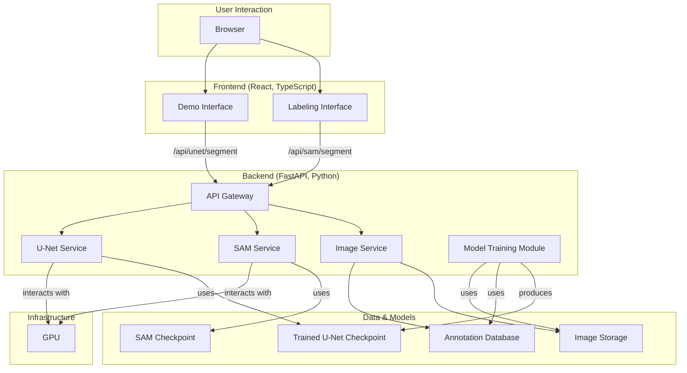

# Nail Segmentation AI Project (v1.0)

A deep learning project for accurate nail segmentation from grayscale finger images. This repository contains the complete end-to-end solution, including data labeling tools, model training pipelines, and a real-time model serving system.

## Project Status

**Current Version:** 1.0 (MVP)
**Development Stage:** Active Development / Partially Implemented

This project is under active development. Key features have been implemented, including the backend services for SAM and U-Net models, and the frontend interfaces for data labeling and model demonstration.

### Implemented Features
- **Interactive Labeling Interface:** Web-based tool for creating segmentation masks.
- **SAM Integration:** `Segment Anything` model for high-quality initial annotations.
- **Custom U-Net Model:** An `Attention U-Net` model trained for nail segmentation.
- **Model Serving:** FastAPI backend serving both SAM and U-Net models.
- **Real-time Demo:** A web interface to test the trained U-Net model on new images.
- **Comprehensive Training Pipeline:** Scripts and utilities for training, evaluation, and data management.

## System Architecture

The system is composed of a Python/FastAPI backend and a TypeScript/React frontend.



## Setup and Installation

### Prerequisites
- Python 3.8+
- Node.js 16+
- CUDA-capable GPU (strongly recommended for performance)
- `git-lfs` for handling large model files.

### Backend Setup
1.  **Clone the repository:**
    ```bash
    git clone https://github.com/your-username/nail-segmentation.git
    cd nail-segmentation
    ```
2.  **Set up Python virtual environment:**
    ```bash
    python -m venv venv
    source venv/bin/activate  # or `venv\Scripts\activate` on Windows
    ```
3.  **Install dependencies:**
    ```bash
    pip install -r backend/requirements.txt
    ```
4.  **Download Model Checkpoints:**
    - **SAM:** The `vit_l` model will be automatically downloaded on first use. Ensure you have an internet connection.
    - **U-Net:** Place your trained `.pth` model checkpoint in a directory specified by your configuration (e.g., `backend/src/training/logs/`).

5.  **Start the backend server:**
    ```bash
    cd backend
    python main.py
    ```
    The API will be available at `http://localhost:8000`.

### Frontend Setup
1.  **Navigate to the frontend directory:**
    ```bash
    cd frontend
    ```
2.  **Install dependencies:**
    ```bash
    npm install
    ```
3.  **Start the development server:**
    ```bash
    npm start
    ```
    The web application will be available at `http://localhost:3000`.

## Usage
Once both the backend and frontend servers are running:

1.  **Data Labeling:**
    - Access the labeling interface at `http://localhost:3000/`.
    - Use the navigation controls to browse images located in `frontend/public/images/`.
    - Draw a bounding box around the nail.
    - Click "Process with SAM" to get an initial segmentation.
    - Review and save the annotation.

2.  **Model Demo:**
    - Access the demo interface at `http://localhost:3000/demo`.
    - Use the navigation controls to browse images.
    - Click "Segment Image" to get a real-time segmentation from the trained U-Net model.
    - The result mask will be overlaid on the image.

## API Documentation
The backend exposes RESTful endpoints for all services.

### Health & Info Endpoints
- `GET /health`: Overall system health, including all services.
- `GET /api/sam/health`: Health status of the SAM service.
- `GET /api/sam/model-info`: Get information about the loaded SAM model.
- `GET /api/unet/health`: Health status of the U-Net service.
- `GET /api/unet/model-info`: Get information about the loaded U-Net model.

### Segmentation Endpoints
#### SAM Segmentation
```http
POST /api/sam/segment
Content-Type: application/json
Body: {
    "image_id": "SizectorS_1.bmp",
    "bounding_box": [100, 150, 300, 400]
}
Response: {
    "masks": [{"points": [[x1, y1], ...], "confidence": 0.98}]
}
```

#### U-Net Segmentation
```http
POST /api/unet/segment
Content-Type: application/json
Body: {
    "image_data": "base64_encoded_image_string...",
    "threshold": 0.5
}
Response: {
    "mask_data": "base64_encoded_mask_image_string...",
    "confidence": 0.99
}
```

## Project Structure
The project is organized into `backend` and `frontend` directories, with clear separation of modules.

```
nail-segmentation/
├── backend/
│   ├── src/
│   │   ├── config/      # Configuration for services
│   │   ├── data/        # Data management
│   │   ├── sam/         # SAM integration and service
│   │   ├── unet/        # U-Net serving components
│   │   ├── serving/     # Base classes for model serving
│   │   ├── training/    # U-Net model training pipeline
│   │   └── server/      # FastAPI server and API routes
│   ├── tests/
│   └── requirements.txt
├── frontend/
│   ├── src/
│   │   ├── components/  # Reusable React components
│   │   ├── contexts/    # React contexts for state management
│   │   ├── pages/       # Top-level page components
│   │   ├── services/    # API service wrappers
│   │   └── types/       # TypeScript type definitions
│   └── package.json
└── .tasks/              # Task definition files
```

## Common Issues

### Installation
1.  **CUDA/PyTorch Errors:**
    - Ensure your NVIDIA driver version is compatible with the CUDA toolkit version required by PyTorch. Check the official PyTorch website for the correct installation command for your system.
2.  **SAM Model Download Fails:**
    - The backend needs to connect to the internet on its first run to download the SAM checkpoint. Check your firewall and proxy settings. You can also manually download it and place it in the specified cache directory.

### Runtime
1.  **GPU Out of Memory:**
    - Both SAM and U-Net can be memory-intensive. If you encounter OOM errors, consider using a smaller model variant (e.g., SAM `vit_b`) or reducing the batch size in the configuration files.
2.  **503 Service Unavailable for U-Net:**
    - This error means the U-Net model failed to load at startup. Check the backend server logs for errors related to missing checkpoint files, corrupted files, or configuration issues.
3.  **CORS Errors:**
    - The backend is configured to allow requests from `http://localhost:3000`. If you are running the frontend on a different port, you must update the `CORSMiddleware` configuration in `backend/main.py`.

## Development Workflow
This project follows the **RIPER-5** development protocol, with detailed planning and execution tracked in `.md` files within the `.tasks/` directory.

### Git Workflow
1.  Create a feature branch from `main`: `git checkout -b feature/your-feature-name`
2.  Make changes and commit with clear, descriptive messages.
3.  Push changes to the remote repository.
4.  Create a Pull Request for review.

### Code Review Process
1. All changes require at least one reviewer
2. CI checks must pass
3. Code coverage must not decrease
4. Documentation must be updated

### Testing Requirements
1. Unit tests for new features
2. Integration tests for API changes
3. End-to-end tests for UI changes
4. Performance tests for model changes

## Contributing

Please read CONTRIBUTING.md for details on our code of conduct and the process for submitting pull requests.

## License

This project is licensed under the MIT License - see the LICENSE file for details.
